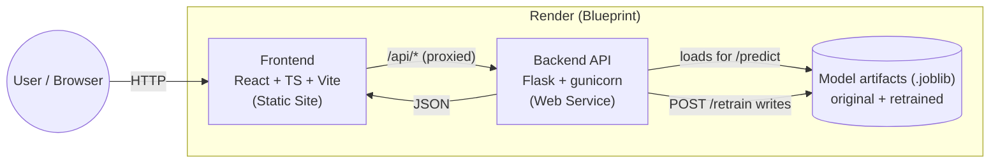

[](./README.md)
[](./README.es.md)

# SPA Occupancy


Backend and frontend for a spa occupancy prediction app, meant to be deployed on Render as two independent services from this same repository (`render.yaml` at the root).

## Architecture



Model artifacts live on Render's free-tier ephemeral disk — a retrained model is lost on restart/sleep and the service falls back to the version-controlled artifact. See [Deployment on Render](#deployment-on-render) for details.

## Repository layout

```
.
├── backend/            REST API (Flask) that serves and retrains the prediction model
│   ├── app/               Model domain logic, framework-free
│   │   └── utils/             Feature engineering for training and prediction
│   ├── tests/              Prediction and retraining tests
│   ├── data/               Occupancy CSV used for training
│   └── models/             Serialized model artifacts (.joblib)
├── frontend/           React + Vite + TypeScript app that consumes the API
│   ├── src/                App source code
│   │   └── api/                API client and mock data
│   └── public/             Static files served as-is (sample CSV, etc.)
├── Endpoints.md        Full endpoint reference (every route, JSON examples, error codes)
├── render.yaml         Render Blueprint defining both services
├── .gitignore
└── README.md
```

* **`backend/main.py`**: routing is deliberately concentrated here — every route, request-shape validation and the `errorhandler`s. The rest of the modules are framework-free dependencies, so they can be tested and reused without spinning up the app, and there is only one place to look to know what the API exposes.
* **`backend/app/model_service.py`**: cached loading of the model artifact and prediction logic (single-day and range), with no Flask dependency.
* **`backend/app/train_model.py`**: retraining, dataset validation and reading the historical data.
* **`backend/app/retrain.py`**: ingestion of the CSV received through `POST /retrain`.
* **`backend/app/utils/`**: feature engineering, shared between training and prediction.
* **`backend/app/README_reentrenamiento.md`**: full write-up of the retraining lane (summarized below).
* **`backend/data/`**: occupancy CSV (`fecha_cita`, `tramo`, `n_citas`). It doesn't live inside `app/` because it's a resource, not code.
* **`backend/models/`**: serialized artifacts, siblings of `main.py` for the same reason as `data/`:
  * `modelo_ocupacion.joblib` — factory model, version-controlled, **never overwritten**.
  * `scaler.joblib` — factory scaler, version-controlled.
  * `modelo_reentrenado.joblib` — published by `POST /retrain`, git-ignored.
  * `backup/` — copies of the previous `modelo_reentrenado.joblib`, saved right before a new retrain overwrites it. `POST /retrain/reset` also clears these when it returns to the factory state.

  If `modelo_reentrenado.joblib` exists, it's the one that gets used; otherwise it falls back to the factory model. The version-controlled artifact is read-only, so returning to the original never depends on a backup being intact: deleting the retrained file is enough, which is exactly what `POST /retrain/reset` does.
* **`backend/tests/`**: tests for the prediction logic and the retraining flow.
* **`frontend/src/types.ts`**: types that model the API contract on the frontend.
* **`frontend/src/api/mock.ts`**: mock data the app uses when `VITE_USE_MOCK=true`.
* **[`Endpoints.md`](./Endpoints.md)**: full API reference (every route, JSON examples, the complete error-code table) — a more exhaustive companion to the [API contract](#api-contract-backend) section below.

## How it fits together

* The frontend always calls relative `/api/*` routes, never the backend URL directly. In development this is resolved by the proxy in `frontend/vite.config.ts`, and in production by the static site's rewrite rule (`render.yaml`).
* `frontend/src/api/client.ts` calls `/predict/single` and `/predict/range` as `GET`, with parameters in the query string (no body), matching the backend contract.
* Since the browser only ever sees a single origin, there's no need for CORS or for rebuilding the frontend when the backend URL changes.
* Each folder is its own Render service with its own `rootDir`, so one service's build and dependencies never affect the other.
* Time slots always travel without the Spanish `ñ` (`manana` / `tarde`) in the API contract; the `ñ` is an internal detail of the model and the dataset. Both spellings are accepted as input.

## Frontend

Pages:

* **Home (`/`)**: explains the app and links to Predict and Retrain.
* **Predict (`/predict`)**:
  * Single date: date + time slot (morning/afternoon) → table with the predicted appointments.
  * Date range: two stacked bar charts (morning + afternoon) side by side — predicted occupancy for the chosen period and the actual occupancy for the same period the previous year (if historical data is available).
* **Retrain (`/retrain`)**: download a sample CSV, and submit new data (pasted text or a file) validated against that same format before sending it to the backend.

More detail — including the app layout, navigation and the floating status widget — lives in [`frontend/README.md`](./frontend/README.md).

**Data format for retraining**, CSV with the exact header `fecha_cita,tramo,n_citas`:

```
fecha_cita,tramo,n_citas
2026-07-01,manana,4
2026-07-01,tarde,7
```

* `fecha_cita`: `YYYY-MM-DD`
* `tramo`: `manana` or `tarde` (`mañana` is also accepted)
* `n_citas`: integer ≥ 0 (actual number of appointments for that slot)

This is the same format the backend consumes, so the file is validated in the browser before it's sent. The sample file is served from `public/ejemplo_retrain.csv` and can be downloaded from the Retrain page.

## API contract (backend)

This mirrors the canonical contract documented in [`backend/README.md`](./backend/README.md); see also [`Endpoints.md`](./Endpoints.md) for the exhaustive reference.

`backend/main.py` exposes these endpoints. Time slots always travel without the `ñ` (`manana`/`tarde`); both spellings are accepted as input. The API accepts routes with or without a trailing slash indistinctly (`strict_slashes = False`), to tolerate both a hand-typed URL and whatever an evaluation script generates.

### `GET /`
Landing: API description and list of endpoints.

### `GET /health`
Liveness check. Always returns 200, even without a loaded model — it's a liveness check, and returning an error would only make Render restart the service in a loop.

```json
{"status": "ok", "model_loaded": true, "entrenado_hasta": "2026-01-24",
 "version_modelo": "original", "es_original": true}
```
`es_original` is `false` when a retrained model is active. The frontend uses it to offer the restore button in the floating status widget.

### `GET /predict` (alias `GET /predict/single`)
```
// input (query string)
?date=2026-09-10&tramo=manana
// output
{"date": "2026-09-10", "tramo": "manana", "citasPrevistas": 2.7,
 "es_cierre": false, "version_modelo": "original", "entrenado_hasta": "2026-01-24"}
```
* Parameters in the query string, not the body: `date` (also accepts `fecha`) and `tramo`.
* Closed days (Dec 25th, Jan 1st, Jan 6th) return `citasPrevistas: 0` without querying the model (`es_cierre: true`).
* `version_modelo` and `entrenado_hasta` aren't used by the frontend, but they make explicit that the figure comes from a real prediction of the currently active model.
* `GET` only, no `POST`: it's a read-only query, so `GET` is the only verb that makes sense, and it's also what the evaluation criteria require — it works both with `requests.get(url, params={...})` and by pasting the URL directly into a browser.

### `GET /predict/range`
```
// input (query string)
?startDate=2026-09-08&endDate=2026-09-14
// output
{
  "current":      [{"date": "2026-09-08", "manana": 2.7, "tarde": 3.6}, ...],
  "previousYear": [{"date": "2025-09-08", "manana": 3.0, "tarde": 5.0}, ...]
}
```
* `current` holds predictions; `previousYear` is the actual occupancy for the same period one year before, read from the historical data in `data/`.
* `previousYear` is `null` if there's no historical data for that period. If only part of it exists, only the days that actually exist are returned: it's never padded with zeros, because `n_citas = 0` is a genuinely observed value and padding would make the chart lie.
* The range can't exceed 366 days.

### `GET /retrain`
Status of the deployed model, detected datasets and usage instructions.

### `POST /retrain`
Accepts the CSV in two ways: as a file in the `file` field (`multipart/form-data`) or as JSON `{"csvText": "<content>"}`.

```json
// 200 — the model has been replaced
{"status": "ok",    "rowsIngested": 14, "message": "Se han incorporado 14 filas y el modelo..."}
// 200 — the candidate didn't pass validation; the previous model stays active
{"status": "error", "rowsIngested": 14, "message": "Se han recibido 14 filas, pero el modelo NO..."}
```
A rejected candidate deliberately responds with 200 rather than an HTTP error: the CSV was processed correctly, so the frontend can show how many rows it read and why the model wasn't published.

### `POST /retrain/reset`
Returns to the factory state: deletes `modelo_reentrenado.joblib`, the uploaded CSVs (`data/subida_*.csv`) and the backups. Idempotent.

```json
{"status": "ok", "modelRestored": true, "filesRemoved": 1, "message": "..."}
```
Requires `X-Retrain-Token` under the same conditions as `POST /retrain`.

### Errors
All errors come back as JSON, shaped as `{"error": "..."}`:

| Code | When |
|---|---|
| 400 | Malformed data: date, time slot, inverted range, invalid CSV, no new rows. |
| 401 | Missing `X-Retrain-Token` while the server has `RETRAIN_TOKEN` configured. |
| 405 | Method not allowed — `/predict` and `/predict/range` are `GET`-only. |
| 409 | A retrain is already in progress. |
| 413 | The CSV is larger than 2 MB. |
| 503 | The model artifact isn't available. |

### Retraining

The received CSV is added to the history, not swapped in as a replacement: it's saved under `data/` with a name (`subida_<timestamp>.csv`) that sorts after the base dataset, so that on overlap the most recent data wins.

The model is then retrained on everything under `data/`, and the new model is published only if it doesn't clearly perform worse than the current one on a temporal holdout: the threshold is the current model's MAE on that same window, with a 10% margin (`MARGEN_TOLERANCIA_MAE`) — not a comparison against a naive baseline or a fixed ceiling, which used to reject valid retrains with real data just because, by chance, that particular window favored the reference. That fixed ceiling (`MAE_MAXIMO_ACEPTABLE`) is only used for the very first training, when there's no previous model to compare against.

The CSV is kept even if the model isn't published. It's real data: a candidate not beating the current model in this particular validation doesn't invalidate it as an observation. It's only discarded if it couldn't even be evaluated (e.g. it doesn't add any row that wasn't already there).

The only requirement is that there are genuinely new rows (more than there were when the current model was trained). Without that, the upload is rejected: retraining and republishing without any new information would be pointless. Given that, there are two valid ways to contribute new rows, and the validation window adapts to which one it is:

1. **Extending the horizon** (uploading a new week, for example): the validation window (60 days by default) is shortened — never lengthened — to the days that are genuinely later than the current `entrenado_hasta`. Without this adjustment, uploading data week by week would never get past the first time: the cutoff (max date minus 60 days) would fall before the currently trained date even though the uploaded week was genuinely new.
2. **Filling a historical gap** (dates earlier than the latest one already recorded): since there are no new days at the end to isolate as a hold-out, the full validation window is used over the already-known final stretch, comparing whether adding those rows improves or worsens the model there.

In both cases the model is only published if it genuinely improves; filling a gap isn't guaranteed to do so (if the gap is small relative to the total history, it's normal for it to barely move the validation MAE).

Publishing means writing `modelo_reentrenado.joblib`; the factory artifact is never touched, so `POST /retrain/reset` undoes any retrain without needing to restore backups.

The active artifact is cached in memory and only reloaded when the file changes, so a retrain takes effect without restarting the service.

Retraining-lane details live in `backend/app/README_reentrenamiento.md`.

## Local development

Two terminals:

```bash
cd backend && pip install -r requirements.txt && python main.py   # :5000
cd frontend && npm install && npm run dev                         # :5173
```

To work on the frontend without the backend running, copy `frontend/.env.example` to `frontend/.env` and set `VITE_USE_MOCK=true` (the app then uses mock data from `src/api/mock.ts`).

To run the backend tests:
```bash
cd backend && python -B -m unittest discover -s tests -v
```

Frontend build (generates the static site into `frontend/dist/`):
```bash
cd frontend && npm run build
```

⚠️ `scikit-learn` is pinned to the version the artifacts in `models/` were serialized with (see the comment in `backend/requirements.txt`).

## Deployment on Render

This repo uses a [Blueprint](https://render.com/docs/blueprint-spec) — connecting the repo on Render, `render.yaml` creates both services:

* **`spa-occupancy-backend`**: Web Service with `rootDir: backend`, started with `gunicorn main:app` and `/health` as the health check.
* **`spa-occupancy-frontend`**: Static Site with `rootDir: frontend` (`npm ci && npm run build`, publish path `./dist`), with two rewrite rules in this order: `/api/*` towards the backend, and `/*` towards `index.html` for React Router's routing. Thanks to the first rule, the browser only ever sees a single origin, so there's no need for CORS or for baking the backend URL into the build.

⚠️ After the first deploy, `render.yaml`'s `/api/*` rewrite `destination` needs to be corrected with the real public URL Render assigned to the backend (it adds a suffix if the name was already taken), then the static site redeployed. Afterwards, verify requests actually go through the rewrite (using `/retrain` here since it's stable; any endpoint works):

```bash
curl -X POST https://<static-site>/api/retrain \
  -H 'Content-Type: application/json' -d '{"csvText":"fecha_cita,tramo,n_citas\n2026-07-01,manana,3"}'
```

⚠️ On Render's free plan the disk is ephemeral: the retrained model and any uploaded CSVs are lost when the service restarts or goes to sleep, and it falls back to the artifact checked into the repository.

## Contributors

Built as a team project during a bootcamp:

* Emilio Garrote — [@Emigarsan](https://github.com/Emigarsan)
* [@sgusmar](https://github.com/sgusmar)
* [@MCCFern](https://github.com/MCCFern)
* [@lolarealcejudo27](https://github.com/lolarealcejudo27)

This repository ([`Emigarsan/Spa_model_webservice`](https://github.com/Emigarsan/Spa_model_webservice)) is Emilio's personal copy of the original team project, kept as a portfolio piece.
